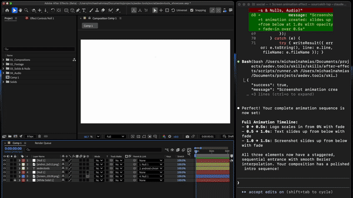

# Adobe Suite Skills

AI agent skills for creative tools. Start with After Effects automation — describe what you want in natural language, and Claude Code (or other agents) will generate and execute the code for you.

Built by [aedev.tools](https://aedev.tools)



```bash
npx skills add aedev-tools/adobe-agent-skills
```

---

## What it does

- **Reads your project** — understands your comps, layers, properties, keyframes, and expressions
- **Generates and runs ExtendScript** — you describe what you want, it writes and executes the code
- **Covers the full AE workflow** — layers, keyframes, expressions, effects, compositions, assets, and rendering
- **Always undoable** — every action wraps in an undo group, Cmd+Z always works

## Example prompts

```
"Animate the table rows in one by one with a slide-up and fade, staggered 0.12s apart"
```

```
"Add a drop shadow to every text layer in this comp and set them all to multiply"
```

```
"Create a lower-third with a background bar, text, and a line accent — animate it sliding in from the left"
```

```
"Find all missing footage in this project and tell me which comps are affected"
```

```
"Precompose all the icon layers into a single comp and loop them"
```

```
"Add expression controls to this null so I can drive all the text colors from one place"
```

## Setup

1. **Install the skill:**

   ```bash
   npx skills add aedev-tools/adobe-agent-skills
   ```

2. **Enable scripting in After Effects:**

   Preferences > Scripting & Expressions > **"Allow Scripts to Write Files and Access Network"**

3. **Start prompting.** Open your AE project, open your coding agent, and describe what you want.

## Requirements

- Adobe After Effects (any recent version)
- macOS (Windows support coming soon)
- A coding agent that supports [Agent Skills](https://agentskills.io) (Claude Code, Cursor, etc.)

## What's inside

The skill includes domain knowledge and tooling across the full After Effects scripting API:

| Domain | Coverage |
|---|---|
| Layers | Create, delete, duplicate, reorder, parent, configure |
| Keyframes & Animation | Set keyframes, easing, interpolation, temporal/spatial control |
| Expressions | Write, link, and debug expressions |
| Effects | Add and configure effects by matchName |
| Compositions | Create, precompose, nest, configure |
| Assets & Footage | Import, replace, organize footage |
| Rendering | Render queue, output modules, export |
| Batch Operations | Bulk modifications across layers and comps |

Plus query scripts that read your project state progressively — from a lightweight overview down to individual layer properties — so the agent only loads the context it needs.

## Feedback & Issues

Found a bug? Have a feature request or idea?
[Open an issue](https://github.com/aedev-tools/adobe-agent-skills/issues) — let's build this together.

## License

Apache 2.0 — see [LICENSE](LICENSE) for details.

---

**Made by [aedev.tools](https://aedev.tools)**
